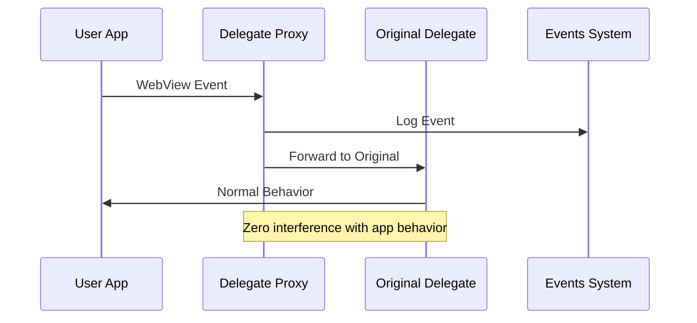
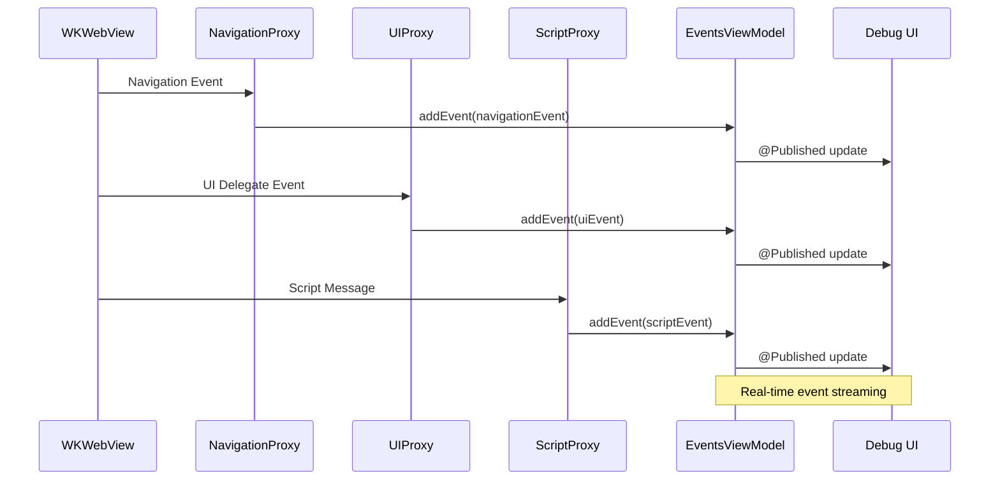

# WKDevKit Architecture

This document describes the architecture and data flow of the WKDevKit library for debugging WKWebView applications.

## System Architecture Flow

```mermaid
graph TD
    %% User Application Layer
    A[User's iOS App] --> B[Custom WKWebView]
    
    %% WKDevKit Integration Point
    B --> C[webView.addDevKitDebugging()]
    C --> D[WKDevKitDebugger]
    
    %% Configuration
    D --> E[WKDevKitConfiguration]
    E --> F{enableEventCapture?}
    E --> G{enableConsoleLogging?}
    E --> H{enableDOMInspection?}
    E --> I{enableStorageInspection?}
    
    %% Event Capture System
    F -->|Yes| J[Setup Delegate Proxies]
    J --> K[NavigationDelegateProxy]
    J --> L[UIDelegateProxy]
    J --> M[ScriptMessageHandlerProxy]
    
    %% Original Delegates Preservation
    K --> K1[originalNavigationDelegate]
    L --> L1[originalUIDelegate]
    M --> M1[originalScriptHandler]
    
    %% Event Flow
    K --> N[WKNavigationDelegate Events]
    L --> O[WKUIDelegate Events]
    M --> P[WKScriptMessageHandler Events]
    
    N --> Q[EventsViewModel.addEvent()]
    O --> Q
    P --> Q
    
    Q --> R[WKWebViewEvent Storage]
    R --> S[Event Filtering & Search]
    S --> T[WKWebViewEventsView]
    
    %% Console Logging System
    G -->|Yes| U[JavaScript Console Override]
    U --> V[Console Messages Captured]
    V --> W[ConsoleMessageHandler]
    W --> X[WKDevKitDebugger.consoleLogs]
    X --> Y[WKDevKitConsoleView]
    
    %% DOM Inspection System
    H -->|Yes| Z[JavaScript DOM Extraction]
    Z --> AA[fetchDOMTree()]
    AA --> BB[DOMNode Tree Structure]
    BB --> CC[WKDevKitDOMInspector]
    
    %% Storage Inspection System
    I -->|Yes| DD[JavaScript Storage Access]
    DD --> EE[fetchWebStorage()]
    EE --> FF[localStorage Data]
    EE --> GG[sessionStorage Data]
    EE --> HH[Cookies Data]
    FF --> II[WebStorageItem Array]
    GG --> II
    HH --> II
    II --> JJ[WKDevKitStorageView]
    
    %% Debug Panel Integration
    T --> KK[Debug Panel TabView]
    Y --> KK
    CC --> KK
    JJ --> KK
    
    %% Data Flow Back to Original Delegates
    K1 -.->|Forward Events| LL[Original Navigation Behavior]
    L1 -.->|Forward Events| MM[Original UI Behavior]
    M1 -.->|Forward Messages| NN[Original Script Handling]
    
    %% Event Types
    subgraph Events [Event Types Captured]
        direction TB
        N1[didStartProvisionalNavigation]
        N2[didFinishNavigation]
        N3[decidePolicyForNavigationAction]
        N4[didFailNavigation]
        
        O1[runJavaScriptAlertPanel]
        O2[createWebViewWithConfiguration]
        O3[requestMediaCapturePermission]
        
        P1[Custom Script Messages]
        P2[Console Override Messages]
    end
    
    %% Storage Types
    subgraph Storage [Storage Types]
        direction TB
        ST1[localStorage]
        ST2[sessionStorage] 
        ST3[document.cookies]
    end
    
    %% Styling
    classDef userApp fill:#e1f5fe
    classDef wkdevkit fill:#f3e5f5
    classDef proxy fill:#fff3e0
    classDef view fill:#e8f5e8
    classDef data fill:#fce4ec
    
    class A,B userApp
    class C,D,E wkdevkit
    class K,L,M proxy
    class T,Y,CC,JJ view
    class Q,R,X,BB,II data
```

## Component Responsibilities

### Core Integration
- **WKDevKitDebugger**: Main orchestrator that attaches to any WKWebView
- **WKDevKitConfiguration**: Controls which debugging features are enabled

### Event Capture System
- **NavigationDelegateProxy**: Intercepts and logs all WKNavigationDelegate calls
- **UIDelegateProxy**: Intercepts and logs all WKUIDelegate calls  
- **ScriptMessageHandlerProxy**: Intercepts and logs custom script message handlers
- **EventsViewModel**: Manages event collection, filtering, and real-time updates

### Data Extraction Systems
- **Console Override**: JavaScript injection to capture console.log/warn/error calls
- **DOM Extraction**: JavaScript execution to traverse and serialize DOM tree
- **Storage Access**: JavaScript execution to read localStorage, sessionStorage, and cookies

### UI Components
- **WKWebViewEventsView**: Real-time event display with filtering and search
- **WKDevKitConsoleView**: Console message display with syntax highlighting
- **WKDevKitDOMInspector**: Interactive DOM tree browser with search
- **WKDevKitStorageView**: Storage key-value pair inspector

## Key Design Principles

### 1. Non-Invasive Operation


### 2. Composition-Based Design
```mermaid
graph LR
    A[Existing WKWebView] --> B[.addDevKitDebugging()]
    B --> C[Enhanced WebView]
    C --> D[All Original Functionality]
    C --> E[+ Debug Capabilities]
    
    classDef enhance fill:#e8f5e8
    class C enhance
```

### 3. Real-Time Data Flow
```mermaid
graph LR
    A[WebView Events] --> B[Proxy Capture]
    B --> C[EventsViewModel]
    C --> D[@Published Properties]
    D --> E[SwiftUI Auto-Update]
    E --> F[Live Debug Panel]
```

## Event Capture Flow



## Usage Patterns

### Simple Integration
```swift
let webView = WKWebView()
let debugger = webView.addDevKitDebugging()
// Events automatically captured and available at debugger.eventsViewModel
```

### Custom Configuration
```swift
let config = WKDevKitConfiguration.builder()
    .withEventCapture(true)
    .withConsoleLogging(true)
    .withDOMInspection(false)
    .build()

let debugger = webView.addDevKitDebugging(configuration: config)
```

### Standalone Events View
```swift
WKDevKitEventsView(eventsViewModel: debugger.eventsViewModel)
```

This architecture ensures complete debugging capability while maintaining zero interference with the host application's WebView functionality.