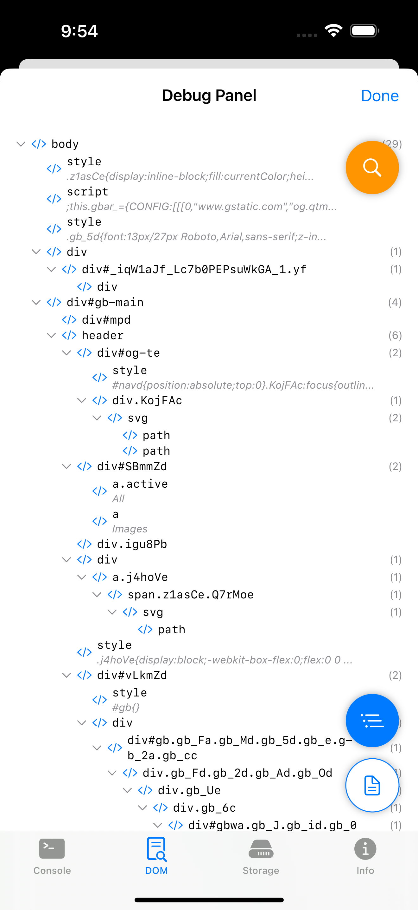
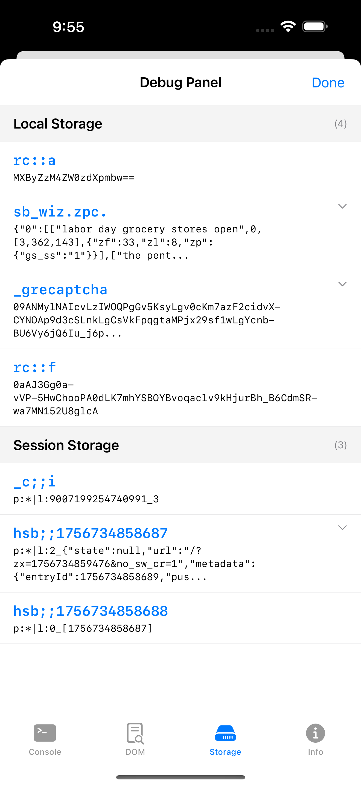

# InAppWebViewInspector

An iOS app that provides in-app debugging capabilities for WKWebView without relying on Safari Web Inspector. Built with SwiftUI for iOS 18.5+.

## Features

### WebView Launch Options

The app supports three ways to launch web content:

1. **Safari Internal** - Opens URLs in SFSafariViewController (in-app browser)
2. **External Safari** - Opens URLs in the device's Safari app
3. **Embedded WebView** - Opens URLs in a custom WKWebView with debugging capabilities

### Debug Panel

The embedded WebView includes a comprehensive Debug Panel accessible via the Debug button in the navigation bar. The panel provides three main tabs:

#### 1. Console Tab
Real-time JavaScript console logging with:
- **Captured Methods**: `console.log`, `console.warn`, `console.error`, `console.info`, `console.debug`
- **Visual Indicators**:
  - Color-coded messages (error=red, warn=orange, info=blue, debug=purple, log=default)
  - Icons for each log type
  - Timestamps for each message
- **Features**:
  - Auto-scroll to latest log
  - Clear button to remove all logs
  - Selectable text for copying log messages

#### 2. DOM Inspector Tab
Interactive DOM tree visualization with multiple view modes:

##### Tree View Mode
- **Hierarchical Display**: Expandable/collapsible DOM nodes
- **Element Information**:
  - Tag names with IDs and classes (e.g., `div#header.nav-bar`)
  - Inner text content preview (truncated to 50 chars)
  - Child count indicators
- **Search Functionality**:
  - Filters nodes by tag, ID, class, or text content
  - Highlights matching text in yellow
  - Shows filtered vs total child count
  - Requires 2+ characters to activate

##### Raw Text Mode
- **HTML Output**: Properly formatted and indented HTML
- **Text Content**: Includes innerText from elements
- **Search Functionality**:
  - Highlights all occurrences in yellow
  - Case-insensitive matching
  - Fully selectable text for copying

##### Floating Action Buttons (FABs)
- **Search FAB** (top-right, orange): Toggle search input field
- **Tree View FAB** (bottom-right): Switch to hierarchical tree view
- **Raw Text FAB** (bottom-right): Switch to HTML text view

#### 3. Web Storage Tab
Comprehensive web storage inspection with automatic loading:
- **Local Storage**: Key-value pairs stored in localStorage
- **Session Storage**: Temporary session-based storage items
- **Cookies**: Document cookies with key-value parsing
- **Features**:
  - Organized by storage type with section headers
  - Item count display for each section
  - Expandable long values (100+ characters)
  - Auto-refresh when tab becomes visible
  - Selectable text for copying

#### 4. Info Tab
Displays current page information:
- Current URL with selectable text
- Clean, readable format

### Technical Implementation

#### JavaScript Injection
The WebView injects custom JavaScript to:
1. **Console Override**: Intercepts console methods and forwards to native code
2. **DOM Extraction**: Recursively traverses DOM tree to capture structure and content
3. **Storage Access**: Extracts localStorage, sessionStorage, and document cookies

#### Native Components
- **WKWebView Configuration**: Custom message handlers for JavaScript communication
- **SwiftUI Integration**: Modern declarative UI with proper state management
- **Thread Safety**: Uses `@MainActor` for safe WebView JavaScript evaluation

## Architecture

### Project Structure
```
InAppWebViewInspector/
├── ContentView.swift           # Main view with WebView type picker
├── EmbeddedWebView/
│   ├── WebView.swift           # WKWebView wrapper with console/DOM/storage capabilities
│   ├── EmbeddedWebViewScreen.swift # Container screen
│   ├── DebugPanel.swift        # Debug panel with navigation
│   ├── DebugTabView.swift      # Tabbed debugging interface
│   ├── WebStorageView.swift    # Web storage inspection
│   └── InfoView.swift          # Page information display
├── Item.swift                  # SwiftData model
└── InAppWebViewInspectorApp.swift # App entry point
```

### Key Components

#### EmbeddedWebView/WebView.swift
- `ConsoleMessage`: Struct for console log data
- `WebStorageItem`: Struct for storage data (localStorage, sessionStorage, cookies)
- `WebStorageType`: Enum for storage type classification
- `DOMNode`: Decodable struct for DOM tree representation
- `WebViewModel`: Manages WebView reference and data fetching
- `ConsoleMessageHandler`: WKScriptMessageHandler for console logs
- `WebView`: UIViewRepresentable wrapper for WKWebView

#### EmbeddedWebView/DebugPanel.swift
- `DebugPanel`: Main debug panel with navigation and state management

#### EmbeddedWebView/DebugTabView.swift
- `DebugTabView`: Tabbed interface for debugging tools

#### EmbeddedWebView/WebStorageView.swift
- `WebStorageView`: Storage inspection with sectioned display
- `WebStorageSection`: Section headers for different storage types
- `WebStorageItemRow`: Individual storage item display

#### EmbeddedWebView/InfoView.swift
- `InfoView`: Current page information display

#### Additional Views
- `ConsoleView`: Console log display with auto-scroll
- `ConsoleLogRow`: Individual console message display
- `DOMInspectorView`: DOM tree/raw view with search and FABs
- `DOMNodeView`: Recursive tree node display with search highlighting

## Requirements

- iOS 18.5+
- Xcode 15.0+
- Swift 5.0+

## Building

1. Open `InAppWebViewInspector.xcodeproj` in Xcode
2. Select your target device or simulator
3. Build and run (Cmd+R)

## Screenshots

### DOM Inspector


The DOM Inspector provides both tree view and raw HTML modes with powerful search capabilities.

### Storage Inspector  


The Storage Inspector shows localStorage, sessionStorage, and cookies in organized sections.

## Usage

1. Launch the app
2. Enter a URL in the text field
3. Select "Embedded WebView" from the picker
4. Tap "Launch" to open the WebView
5. Tap "Debug" in the navigation bar to access debugging tools

## Debugging Features

### Console Monitoring
- View all JavaScript console output in real-time
- Filter by log level using color coding
- Copy specific log messages for further analysis

### DOM Inspection
- Explore the complete DOM structure
- Search for specific elements or content
- View element attributes and text content
- Export HTML structure via copy/paste

### Web Storage Inspection
- Complete localStorage, sessionStorage, and cookie access
- Organized sectioned display by storage type
- Auto-loading when storage tab is accessed
- Expandable values for long content

### Search Capabilities
- Global search across DOM tree
- Highlight matching elements
- Filter tree to show only relevant branches
- Case-insensitive text matching

## Future Enhancements

Potential areas for expansion:
- Network request interception and monitoring
- JavaScript execution console
- CSS style inspection
- Performance metrics
- Advanced cookie management features
- Storage item editing capabilities

## License

This project is for educational and development purposes.